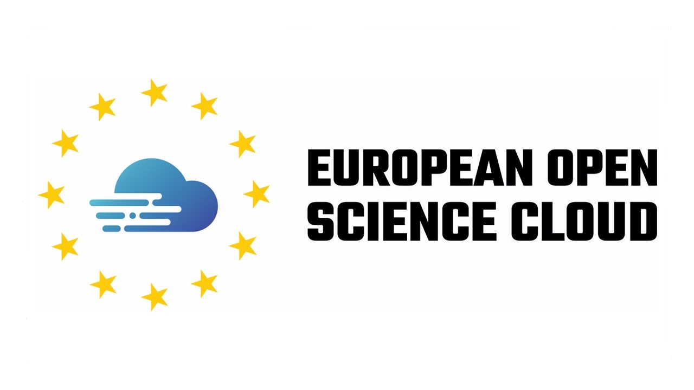
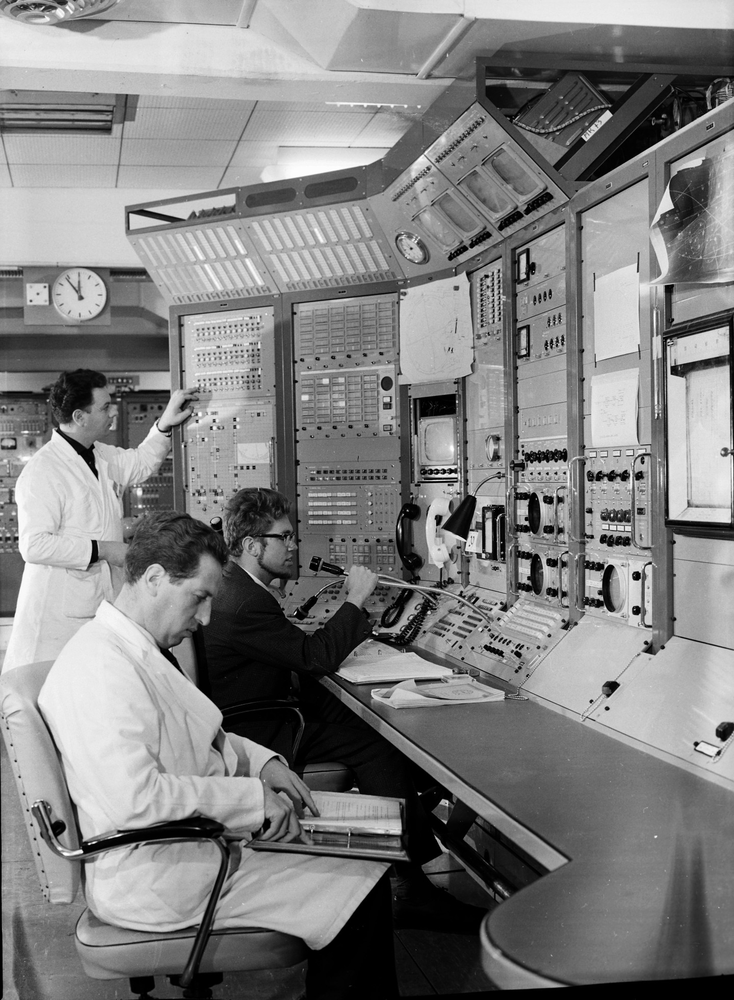
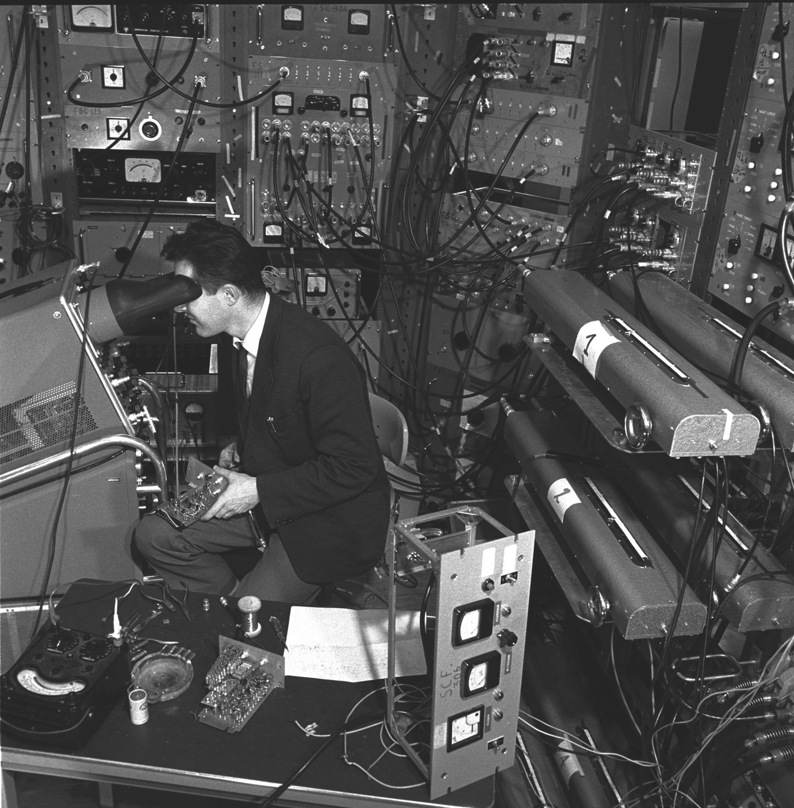
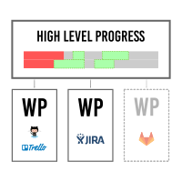
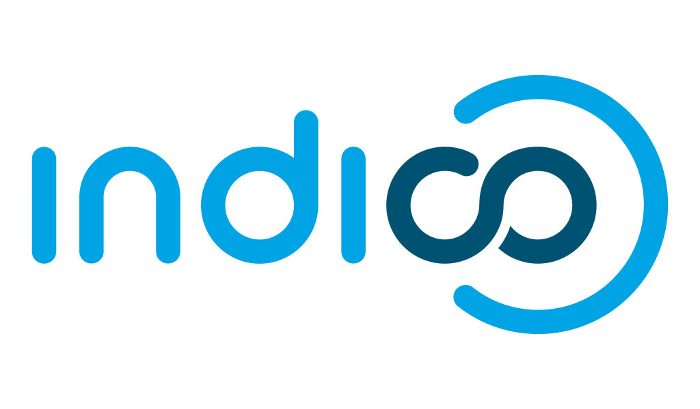

*CS3MESH4EOSC - Work Package 1*

### Pedro Ferreira (CERN)

---

## About me

- At CERN since 2007
- Project and Service Manager (@CERN) of Indico (since 2014)
  - Previously: technical leadership
- Also: Product Management, UI/UX design, communication

---

## WP1
### Project Management

---

## Partners

---

## Objectives (1/2)

- Ensuring proper implementation of the Work Plan and achievement of the CS3MESH4EOSC objectives
- Efficient organisation and day-to-day management of the project
- Monitoring and ensuring on-time delivery of technical, administrative and financial reports

---

## Objectives (2/2)

- Preparing and maintaining the Data Management Plan
- Ensuring proper interaction among collaborating partners & managing legal issues
- Networking and partnership with stakeholders, industries and other projects
- Oversee measures to facilitate gender equality

---

## Project Tasks

---

## T1.1

<!-- _class: wp-slide -->

### Scientific, financial and administrative project management

*CERN + DTU*

- Monitoring progress
- Strategy
- Communication with EC
- **Deliverables**: Periodic Reports to EC

<!-- _footer: 'CC BY-NC-SA 4.0 • Photo: © 1963-2020 CERN' -->

---

## Monitoring Progress

- Continuous process 🗓
- As direct as possible ⇄

<!-- _footer: 'CC BY-NC-SA 4.0 • Photo: © 1961-2020 CERN' -->

---

---

## Strategy

### Principles of Project Management

- Iterative rather than sequential ("Agile") ↺
- Horizontal communication ⇆
- Focused on concrete and working deliverables ◎
- Deliverables should be useful ⚑

---

## T1.2

<!-- _class: wp-slide -->

### Legal issues coordination and Project Risk Management.

*CERN*

- Identifying legal issues
- Taking mitigation steps
- **Deliverables**: Risk Assessment Plan, IPR Plan, DMP, QAP (**D1.3** + **D1.4**)

<!-- _footer: 'CC BY-NC-SA 4.0 • Photo: © 1964-2020 CERN' -->

---

## Legal Issues

- Signed agreement
- Data Privacy

---

## Risks

- Underestimating effort
- Mismatch w/ user expectations
- No commercial value
- EFSS providers ceasing activity

---

## T1.3

<!-- _class: wp-slide -->
### Internal communication and organisation of meetings. (CERN)

*CERN*

- Communication/Collaboration tools
- Organization of meetings (Kick-off, StC, General Assembly, EAB...)
- Website *(?)*
- **Deliverables**: Website and Minutes (**D1.1** + **D1.2**)

<!-- _footer: 'CC BY-NC-SA 4.0 • Photo: Public Domain' -->

---

## Tools (so far)

- Communication (video-conferencing) → Zoom (DTU)
- Meeting organization → Indico (CERN)
- File sharing → CERNBox (CERN)
- *Any other needs?*

---

## Deliverables

- **D1.1**: Agendas + minutes (all meetings) (T1.3)
- **D1.2**: Project Website *(?)*
- **D1.3**: Following plans (+ updates) (T1.2):
  - **Quality Assurance**
  - **IPR**
  - **Risk Assessment**
- **D1.4**: Data Management Plan + updates (T1.2)
- **Progress Reports** for EU (T1.1)

---

## Immediate Targets

- **Tomorrow**⚠️: D1.1 (agendas + minutes)
- **February**: D1.2
- **March**: D1.3 & D1.4

---

## Manpower

- CERN (24 PM)
  - Anna (taking over from Jimmy), Kuba, Pedro
- DTU (6 PM)
  - Frederik
