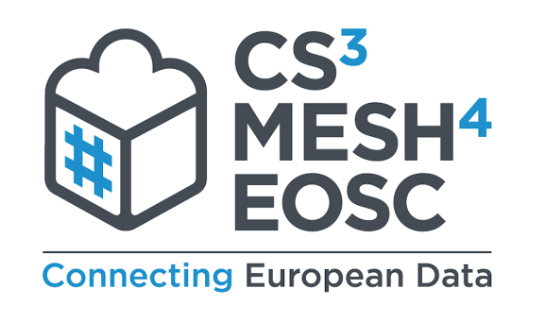

<!-- _class: title-slide -->

## An Interoperable Federation of EFFS services for European Open Science Cloud

### Pedro Ferreira (CERN)

---

## The Idea

 * **Decentralized** mesh of EFSS nodes
 * Based on **Open Standards** and **Open Source**
 * **Interoperable Platform** to easily share and deploy applications and components

---

---

## Objectives

 * **Application platform** for distributed collaboration
 * **Federated** research space for Europe (and the world!)
 * Leveraging the potential of the **CS3 Community**

---

## EFSS Integration

### Objectives

 * Platform-specific plugins;
 * Implement "Invite workflow" from EFSS system;
 * A User Interface which feels seamless;

---

## EFSS Integration

* Nextcloud
  - outsourced to PonderSource (alpha stage);
  - UX and backend;
* ownCloud
  - OCIS - using REVA, still UX work to do;
  - version 10 - backport by PonderSource (March 2022);
* Seafile
  - under discussion

---
## Federation

* Established Roadmap for Trust
* Federated Identity
* Registry (GOCDB, Mentix)
* Monitoring (Prometheus, Grafana)
* Security
* **Up and running mid-2021!**

---
<!-- _footer: 'Photo by Markus Spiske from [Pexels](https://www.pexels.com/photo/creative-dark-internet-designer-6190327/)' -->

## Applications

---
<!-- _footer: 'Logos are property of the respective projects' -->

---

Data Science / Data Transfers

 
 

Markdown Editor / ScieboRDS

---

# Data Science Environment

JupyterHub-based Notebook Editing

https://github.com/sciencemesh/cs3api4lab

---

# Open Data Workflow

ScieboRDS + Describo Online

https://github.com/Sciebo-RDS/port-reva
https://github.com/Arkisto-Platform/describo-online

---

# Markdown Editor

CodiMD from you EFSS

https://github.com/cs3org/wopiserver/blob/master/src/bridge/readme.md

---

<!-- _footer: '' -->

## Synergies

 * Conversations with several vendors about new features and integrations
   - e.g. sponsoring developments in **Rclone**
 * Open Data partnership involving UTS, PARADISEC (AU), Zenodo
   - Based on WWU's **Sciebo RDS** and UTS's **Describo**

---
<!-- _footer: '' -->

Peter Heiss, Lennart Hofeditz -  [Progress of Sciebo Research Data Services](https://indico.cern.ch/event/970232/contributions/4157920/)

---
<!-- _footer: '' -->

Marco La Rosa, Peter Sefton -  [Describo and RO-Crate - the FAIR data research helpers](https://indico.cern.ch/event/970232/contributions/4158369/)

---

**You app/service could be the next one!**

---
## Cubbit
<!-- _footer: '' -->

 * CS3Mesh on a physical device!
 * Integration with CS3APIs/IOP

*Gianluca Granero - [Cubbit Hive: the private distributed cloud](https://indico.cern.ch/event/970232/contributions/4158359)*

---
## Communications
<!-- _footer: '© Copyright 2020-2021 CS3MESH4EOSC Project Partners' -->

 * **Project** [website](https://cs3mesh4eosc.eu) and branding
   - Newsletters, [@cs3org](https://twitter.com/cs3org) and others
 * **ScienceMesh** [website](https://sciencemesh.io) and branding
   - [Documentation](https://developer.sciencemesh.io) on how to join
 * **Events** such as this one!

---
## Roadmap

 1. **mid-2021** - Consolidation of Proof of Concept (user sharing)
 2. **early 2022** - Second prototype - sharing with groups of users
 3. **late 2022** - Production infrastructure, applications fully integrated

---
## Conclusion

 * Lots of things for you to **discover**
 * ... but it's also about **your** ideas
 * **We hope you will like the workshop!**
