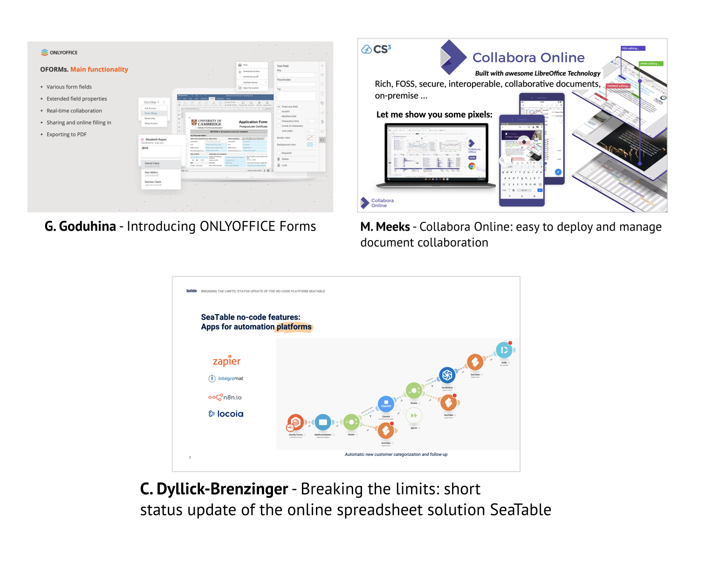

<!-- _class: title-slide -->

## Workshop on Cloud Services for Synchronisation and Sharing

### A Summary

#### by Pedro Ferreira

---

## 8th edition!

### 24 - 27 Jan 2022

 * 2014 - Genève
 * 2016 - Zürich
 * 2017 - Amsterdam
 * 2018 - Kraków
 * 2019 - Roma
 * 2020 - København
 * 2021 - **Virtual**
*  2022 - **Virtual**

---

## What is it about?

* **Sync & Share Cloud Storage, on-premises, FOSS**
  * Sites and Services: *DESY Sync & Share, CERNBox, BNLBox...*
  * Storage Technology: *EOS, GPFS, CEPH, dCache, ...*
  * EFSS Companies: *ownCloud, Nextcloud, Seafile...*

---

## What is it about?

* **Integrated Services**
  * Collaborative Tools: *OnlyOffice, Collabora, ...*
  * Research Services: *Jupyter, Open Data Repositories, FAIR metadata ...*
* **Projects and Federations**
  * *European Open Science Cloud, ScienceMesh, HIFIS ...*

---

## What is it about?

* New: **Decentralized Web and Storage**
  * IPFS, Solid, ...
  * web3, Fediverse...
* **Thematic workshops**
  * Interoperability protocols and APIs
  * ScienceMesh

---

## Attendance

* **280+** registered participants (~310 previous year)
* **~120** different organizations
  * Universities, International Organizations, NRENs, Computing Centers, SMEs, Enterprises, European Commission...

---

---

<!-- _footer: Photo by Yaroslav Danylchenko from Pexels -->

## 2021 - 2022

* Needed to go **full virtual** (Zoom)
* Collaborative **tools** (Zoom, gather.town, Indico)

---

## gather.town

* **8-bit-RPG-like** interface 👾
* Game-like **controls** (arrow keys)
* "Line of sight" **video chats**

---

## This time

* More or less same layout
* Rooms for discussions + exhibitor **booths**
* Usage visibly **lower** than previous year...
* Maybe "Zoom fatigue"?

---

## Schedule

---

## Highlights

---

## Keynote: IPFS: Interplanetary filesystem
### Yiannis Psaras (ProtocolLabs)

---
## Keynote: SCION: Experiencing a new Internet Architecture
### Adrian Perrig (ETHZ)

---
## Keynote: Digital Market: a level playing field for EU Tech sector
### Frank Karlitschek (Nextcloud)

---
## EFSS Platforms
### ownCloud, Nextcloud, Seafile

---
## Federated Infrastructures and Clouds

---
## Collaboration Products

---
## Scalable Storage Backends

---
## User Stories

---
# Thematic Sessions

---

## CS3 Org: Governance Campfire Discussion

 * Governance of software products and standards - e.g. CS3APIs, REVA, OCM,...
 * Request from industry for a more active role in governance.

---
## OCM Workshop

 * *OpenCloudMesh* - sharing of files between EFSS systems
 * Extensions done in the context of ScienceMesh

https://indico.cern.ch/event/1075584/contributions/4662258/

---
## ScienceMesh Workshop

---
## ScienceMesh Workshop

 * Two parts:
   - "Status updates"
   - Presentations by EOSC Task Forces and Research Initiatives representatives

---
## ScienceMesh Workshop

 * Progress validated by community
 * New synergies and prospective parters/communities

---

---
### It's all online!

https://indico.cern.ch/e/cs3/2022

---

## Thank you!
### Questions?
