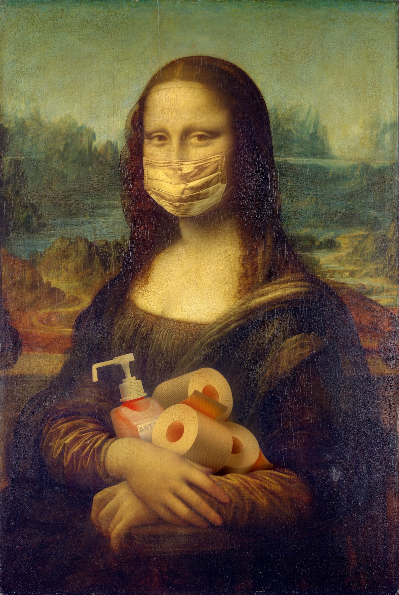
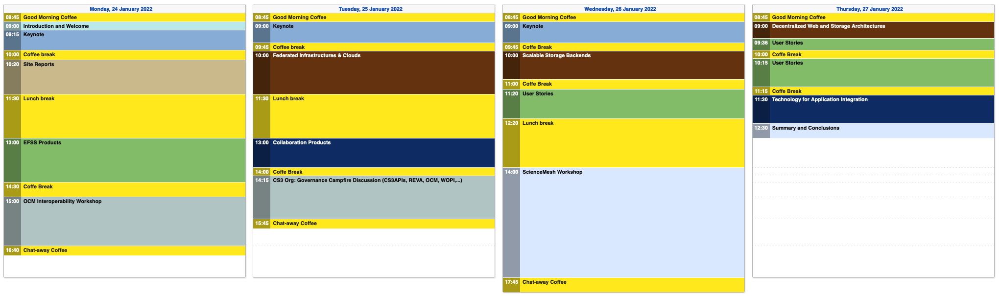

<!-- _class: title-slide -->

## Workshop on Cloud Services for Synchronisation and Sharing

### A Summary

#### by Pedro Ferreira and Jakub Moscicki

---

## 7th edition!

### 25 - 28 Jan 2021

 * 2014 - Genève
 * 2016 - Zürich
 * 2017 - Amsterdam
 * 2018 - Kraków
 * 2019 - Roma
 * 2020 - København
 * 2021 - **Virtual**

---

## What is it about?

* **Sync & Share Cloud Storage, on-premises, FOSS**
  * Sites and Services: *DESY Sync & Share, CERNBox, BNLBox...*
  * Storage Technology: *EOS, GPFS, CEPH, dCache, ...*
  * EFSS Companies: *ownCloud, Nextcloud, Seafile...*

---

## What is it about?

* **Integrated Services**
  * Collaborative Tools: *OnlyOffice, Collabora, ...*
  * Research Services: *Jupyter, Open Data Repositories, FAIR metadata ...*
* **Projects and Federations**
  * *European Open Science Cloud, ScienceMesh, HIFIS ...*

---

## Attendance

* **310+** registered participants (~150 at previous physical event)
* **130+** different organizations
  * Universities, International Organizations, NRENs, Computing Centers, SMEs, Enterprises, European Commission...
* **25+ countries**
  * Mostly Europe, but also Australia, Indonesia, China, Taiwan, Turkey, United States ...

---

---

<!-- _footer: Photo by Yaroslav Danylchenko from Pexels -->

## 2021

* Needed to go **full virtual** (Zoom)
* Rely even more on **tools** we were using (e.g. Indico)
* **Problem**: Conferences are **Social** events!
  * How to spark conversation?

---

## Meet gather.town

* **8-bit-RPG-like** interface 👾
* Game-like **controls** (arrow keys)
* "Line of sight" **video chats**

---

## Our virtual world

* **Rooms** for session discussions
* Exhibitor **booths**
* Lots of **ad-hoc groups** formed
* Usage remained **surprisingly high**!
* **Very appreciated** by the participants!

---

## Schedule

---

## Highlights

---

## On premise or in the cloud?
### Campfire discussion

CERN, Oracle, Ailleron, Cubbit

---
## On premise EFSS Platforms
### ownCloud, Nextcloud, Seafile

---
## EFSS Platforms
### ownCloud, Nextcloud, Seafile

---
## Scalable Storage
### Backend

---
## Scalable Storage
### Frontend

---
## Online Collaboration
### ownCloud, NextCloud, SeaTable

---
## Online Collaboration
### OnlyOffice, Collabora, CERN

---

---

## ScienceMesh

[Link to talk](https://indico.cern.ch/event/970232/contributions/4158375/)

---

## The Idea

 * **Decentralized** mesh of EFSS nodes
 * Based on **Open Standards** and **Open Source**
 * **Federated** environment for collaborative research
 * **Application platform** for distributed collaboration

---

---

---

---

Davide De Marchi -  [JupyterLab for Earth Observation applications with HTCondor scaling and Voilà dashboarding](https://indico.cern.ch/event/970232/contributions/4158372/)

---

Marco La Rosa, Peter Sefton -  [Describo and RO-Crate - the FAIR data research helpers](https://indico.cern.ch/event/970232/contributions/4158369/)

---

Marcin Sieprawski -  [Science Mesh beyond science -- perspectives for adoption in a wider business context.](https://indico.cern.ch/event/970232/contributions/4158378/)

---

Giuseppe Lo Presti -  [CodiMD in CERNBox: leveraging the WOPI protocol to provide collaborative markdown editing](https://indico.cern.ch/event/970232/contributions/4158365/)

---

Mario Lassnig -  [SWAN, Rucio, and Jupyter](https://indico.cern.ch/event/970232/contributions/4157927/)

---

## Workshop

* ~100 participants
* Presentations from the Work Packages
* "The State of ScienceMesh"

---

## ScienceMesh Workshop
### Federation

---

## ScienceMesh Workshop
### Applications

---

## ScienceMesh Workshop
### Joining the Mesh

---
## ScienceMesh Workshop
### Workflow Demo

https://www.youtube.com/watch?v=I0PlqiUBT0I

---

## ScienceMesh Workshop
### Developers

---

---
### It's all online!

https://indico.cern.ch/event/970232/

---

## Thank you!
### Questions?
