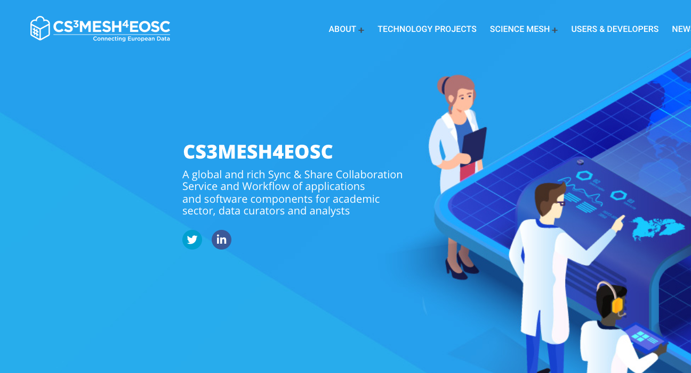

<!-- _class: title-slide -->

## In a nutshell

### Pedro Ferreira (CERN)

---

## Why?

[Link to talk](https://indico.cern.ch/event/970232/contributions/4158375/)

---

## The Idea

 * **Decentralized** mesh of EFSS nodes
 * Based on **Open Standards** and **Open Source**
 * **Federated** environment for collaborative research
 * **Application platform** for distributed collaboration

---

## One year ago...

 * 30-31 January 2020 - **Copenhagen** 🇩🇰
 * Started with 12 partners
   - **Trust-IT** joined in the meantime!
 * Started engaging with the community
   - "Meet the CS3Mesh"
   - nice to see you again! 👋🏻
 * **Very busy year** for the Project!
---

# 2020
*(and why not everything was bad)*

---

---
## Federation

* Established Roadmap for Trust
* Federated Identity
* Registry (GOCDB, Mentix)
* Monitoring (Prometheus, Grafana)
* Security
* **Up and running mid-2021!**

---
## IOP
<!-- _footer: 'Photo by Riki Risnandar from [Pexels](https://www.pexels.com/photo/3-x-3-rubiks-cube-3993855/)' -->

* Established protocols and APIs
  - OCM
* Packaged distribution
* Set up at Partners (8 sites)
* Companion application for ownCloud and Nextcloud
* **You can already join the mesh!**

---
<!-- _footer: 'Photo by Markus Spiske from [Pexels](https://www.pexels.com/photo/creative-dark-internet-designer-6190327/)' -->

## Applications

---
<!-- _footer: 'Logos are property of the respective projects' -->

---
<!-- _footer: 'Logos are property of the respective projects' -->

---
<!-- _footer: '' -->

Davide De Marchi -  [JupyterLab for Earth Observation applications with HTCondor scaling and Voilà dashboarding](https://indico.cern.ch/event/970232/contributions/4158372/)

---
<!-- _footer: '' -->

Marcin Sieprawski -  [Science Mesh beyond science -- perspectives for adoption in a wider business context.](https://indico.cern.ch/event/970232/contributions/4158378/)

---
<!-- _footer: '' -->

Giuseppe Lo Presti -  [CodiMD in CERNBox: leveraging the WOPI protocol to provide collaborative markdown editing](https://indico.cern.ch/event/970232/contributions/4158365/)

---
<!-- _footer: '' -->

Mario Lassnig -  [SWAN, Rucio, and Jupyter](https://indico.cern.ch/event/970232/contributions/4157927/)

---
<!-- _footer: '' -->

## Synergies

 * Conversations with several vendors about new features and integrations
   - e.g. sponsoring developments in **Rclone**
 * Open Data partnership involving UTS, PARADISEC (AU), Zenodo
   - Based on WWU's **Sciebo RDS** and UTS's **Describo**

---
<!-- _footer: '' -->

Peter Heiss, Lennart Hofeditz -  [Progress of Sciebo Research Data Services](https://indico.cern.ch/event/970232/contributions/4157920/)

---
<!-- _footer: '' -->

Marco La Rosa, Peter Sefton -  [Describo and RO-Crate - the FAIR data research helpers](https://indico.cern.ch/event/970232/contributions/4158369/)

---

**You app/service could be the next one!**

---
## Cubbit
<!-- _footer: '' -->

 * CS3Mesh on a physical device!
 * Integration with CS3APIs/IOP

*Gianluca Granero - [Cubbit Hive: the private distributed cloud](https://indico.cern.ch/event/970232/contributions/4158359)*

---
## Communications
<!-- _footer: '© Copyright 2020-2021 CS3MESH4EOSC Project Partners' -->

 * **Project** [website](https://cs3mesh4eosc.eu) and branding
   - Newsletters, [@cs3org](https://twitter.com/cs3org) and others
 * **ScienceMesh** [website](https://sciencemesh.io) and branding
   - [Documentation](https://developer.sciencemesh.io) on how to join
 * **Events** such as this one!

---
## Roadmap

 1. **mid-2021** - Consolidation of Proof of Concept (user sharing)
 2. **early 2022** - Second prototype - sharing with groups of users
 3. **late 2022** - Production infrastructure, applications fully integrated

---
## Conclusion

 * Lots of things for you to **discover**
 * ... but it's also about **your** ideas
 * **We hope you will like the workshop!**
